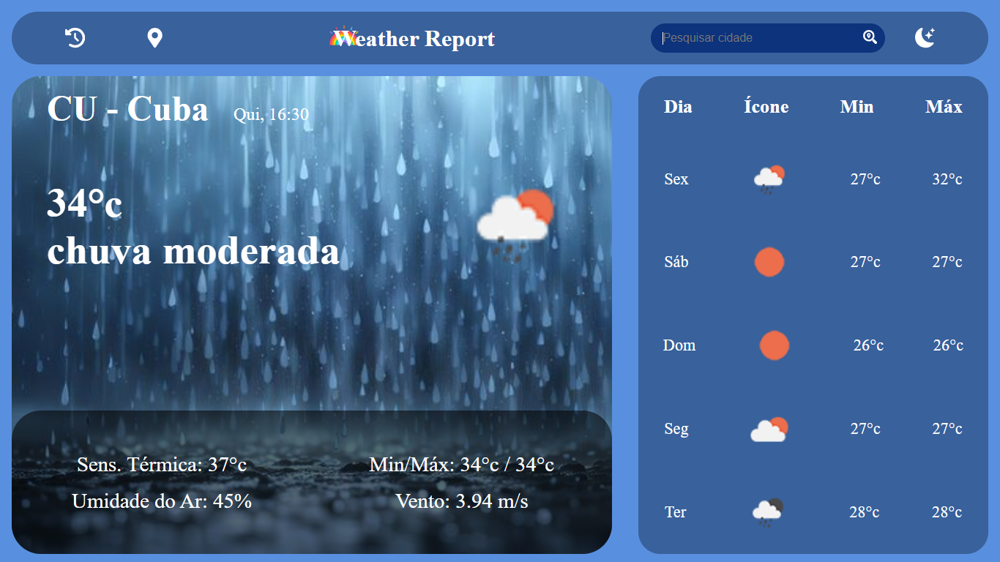
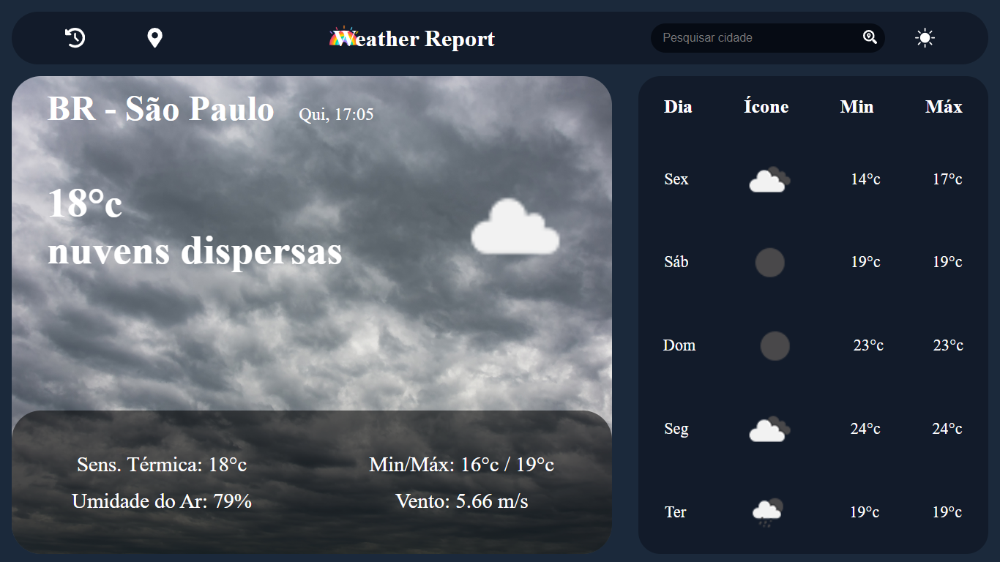
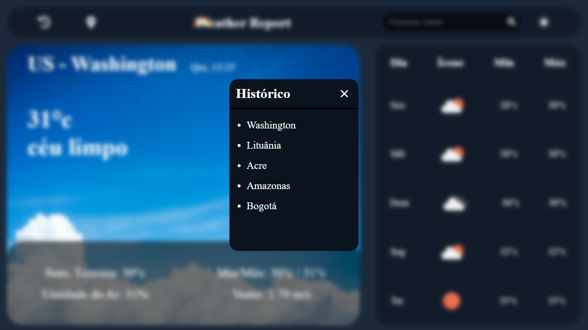

# **Projeto Final Frontend II: Weather Report**

## **Integrantes: Kauan Oliveira Freitas e Thays da Silva Mariano**

### Descrição da Aplicação

Aplicação web feita em React + TypeScript que exibe os dados do clima atual e a previsão para os próximos cinco dias. É possível buscar pelo nome da cidade, usar a localização atual e alternar entre tema claro e escuro. O fundo muda de acordo com o clima, e possui histórico das últimas 5 pesquisas.

## Instruções de compilação
 > [!NOTE]
 > O conhecimento da APIKey é necessário para funcionamento do sistema

 - Clone o repositório como o comando:

 ````
 git clone https://github.com/ThaysMariano/WeatherReport.git 
 ````

 - Abra a pasta com a IDE de sua preferência (Recomendação: Visual Studio Code)

 - Crie um arquivo chamado `.env` e adicione a APIKey de nome `REACT_APP_API_KEY="apikey"` 

 - Abra o terminal e execute os seguintes comandos:

 ```
 npm i 
 ```

  ```
 npm run dev
 ```

 - Abra a página no navegador:   localhost:5173

## Capturas de Tela





### API Utilizada

- [OpenWeatherMap](https://openweathermap.org/)

### Funcionalidades Extras Implementadas

- Localização Atual.
- Tema escuro/claro.
- Imagem de fundo dinâmica integrada com o clima atual.

